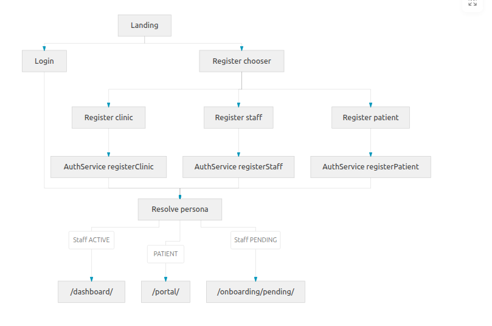
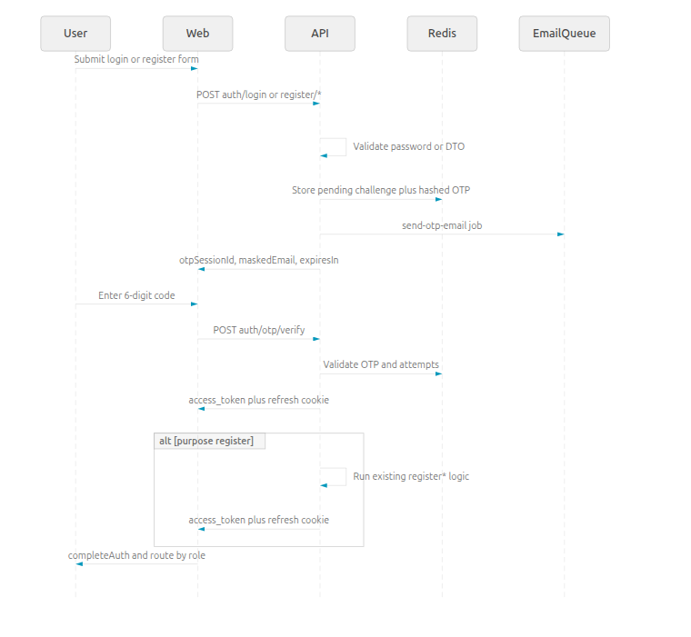
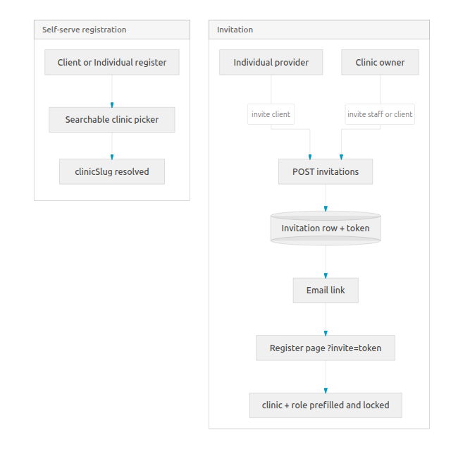

# AI-powered Healthcare CRM

A multi-tenant SaaS CRM tailored for healthcare organizations. The platform combines patient/customer management, organization-level billing via Stripe (subscriptions + Connect payouts), real-time notifications, file storage on Cloudflare R2, and full observability out of the box.

## Tech stack

**Frontend** — `apps/web`
- Next.js 16 (App Router, Turbopack) + React 19
- TypeScript, Tailwind CSS 4, shadcn/ui + Radix UI
- TanStack Query, TanStack Table, Zustand
- React Hook Form + Zod
- Axios with refresh-token rotation
- Socket.IO client for live notifications

**Backend** — `apps/api`
- NestJS 11 on Node.js (Express adapter)
- Prisma 7 + PostgreSQL 16
- JWT auth (access + refresh) with Google OAuth 2.0
- BullMQ workers backed by Redis (emails, payments)
- Socket.IO gateway with Redis adapter
- Stripe SDK (subscriptions + Connect)
- AWS SDK targeting Cloudflare R2 for object storage
- OpenSearch client for search
- Helmet, CORS, CSRF, rate limiting, throttler
- pino logging, Sentry, Prometheus metrics

**Infrastructure**
- Docker Compose for Postgres, Redis, pgAdmin, Prometheus, Grafana
- Nginx reverse proxy in front of `web` + `api` for production builds
- pnpm workspaces + Turborepo

## Repository layout

```
.
├── apps/
│   ├── api/            # NestJS backend (port 3001)
│   │   ├── prisma/     # Prisma schema + migrations
│   │   └── src/modules # auth, billing, stripe, storage, audit, ...
│   └── web/            # Next.js frontend (port 3000)
│       └── src/
│           ├── app/             # App Router routes
│           ├── components/      # UI + layout components
│           ├── features/        # auth, notifications, ...
│           ├── lib/             # api client, socket, proxy/middleware
│           └── providers/       # query, auth, realtime, notifications
├── infrastructure/
│   ├── docker/         # Postgres / Redis / pgAdmin compose stack
│   ├── nginx/          # Production reverse proxy config
│   └── prometheus/     # Scrape config
├── docker-compose.yml  # Full-stack production compose (nginx + web + api + deps)
└── turbo.json
```

## Prerequisites

- Node.js 20+
- pnpm 11 (`corepack enable && corepack prepare pnpm@11.1.2 --activate`)
- Docker + Docker Compose
- A Stripe account (test mode is fine) — optional for non-billing flows
- A Google OAuth client — optional for Google sign-in

## Local development

### 1. Install dependencies

```bash
pnpm install
```

### 2. Start infrastructure (Postgres + Redis + pgAdmin)

```bash
cp infrastructure/docker/.env.example infrastructure/docker/.env
docker compose -f infrastructure/docker/docker-compose.yml --env-file infrastructure/docker/.env up -d
```

| Service     | URL                                | Default creds                |
| ----------- | ---------------------------------- | ---------------------------- |
| Postgres    | `localhost:5432`                   | `admin / admin123`           |
| Redis       | `localhost:6379`                   | —                            |
| pgAdmin     | <http://localhost:5050>            | `admin@local.dev / admin123` |

### 3. Configure environment variables

```bash
cp apps/api/.env.example apps/api/.env
cp apps/web/.env.example apps/web/.env
```

Update `apps/api/.env`:
- `DATABASE_URL` must match the Postgres credentials above.
- Set strong values for `JWT_SECRET` and `JWT_REFRESH_SECRET`.
- Fill in `GOOGLE_*` and `STRIPE_*` if you want OAuth or billing.

### 4. Apply database migrations

```bash
cd apps/api
pnpm prisma migrate deploy   # or `pnpm db:migrate` to create new dev migrations
```

> If you ever see `The table "public.User" does not exist`, you skipped this step.

### 5. Run the apps

In two terminals:

```bash
# Backend (NestJS, http://localhost:3001)
cd apps/api && pnpm start:dev

# Frontend (Next.js, http://localhost:3000)
cd apps/web && pnpm dev
```

Open <http://localhost:3000/register> to create an account, or <http://localhost:3000/login> to sign in.

## Common scripts

### Backend (`apps/api`)

| Command            | Description                              |
| ------------------ | ---------------------------------------- |
| `pnpm start:dev`   | Watch-mode dev server (runs `prisma generate` first) |
| `pnpm build`       | Production build                         |
| `pnpm start:prod`  | Run the compiled `dist/main.js`          |
| `pnpm db:migrate`  | Create + apply a new dev migration       |
| `pnpm db:push`     | Push schema without creating a migration |
| `pnpm db:studio`   | Open Prisma Studio                       |
| `pnpm test`        | Unit tests                               |
| `pnpm test:e2e`    | End-to-end tests                         |
| `pnpm lint`        | ESLint with autofix                      |

### Frontend (`apps/web`)

| Command                       | Description                                       |
| ----------------------------- | ------------------------------------------------- |
| `pnpm dev`                    | Next.js dev server on `0.0.0.0:3000` (Turbopack)  |
| `pnpm next dev --webpack -H 0.0.0.0` | Fallback dev server using webpack (lower memory) |
| `pnpm build`                  | Production build                                  |
| `pnpm start`                  | Serve the production build                        |
| `pnpm lint`                   | ESLint                                            |

## Authentication flow



### Client vs provider portals

Login and register use a **Client | Provider** toggle:

- **Client** — patients (`/portal/`).
- **Provider** — **Organization** (clinic owner → `/dashboard/`) or **Individual** (staff → `/onboarding/pending/` until approved).

### Google OAuth

1. Set in `apps/api/.env`:
   - `GOOGLE_CLIENT_ID`, `GOOGLE_CLIENT_SECRET`
   - `GOOGLE_CALLBACK_URL=http://localhost:3001/api/v1/auth/google/callback` (must include `/v1`)
2. In Google Cloud Console, add the same URL under **Authorized redirect URIs**.
3. **Existing user** — Google login issues tokens and redirects to `/oauth-success`.
4. **New user** — redirected to the matching register page with `?onboarding=<token>` (email prefilled, no password). Complete clinic slug / org details, then submit.

### Email OTP (password login and register)



Password-based **login** and all **register** endpoints (`/auth/register`, `/register/clinic`, `/register/staff`, `/register/patient`) use a two-step flow:

1. Submit credentials or registration form → API returns `{ otpSessionId, email, expiresIn }` (masked email) and queues a 6-digit code.
2. Enter the code on the OTP screen → `POST /auth/otp/verify` issues tokens and sets the refresh cookie.

- **Google OAuth** skips OTP (tokens issued on callback as before).
- **Resend**: `POST /auth/otp/resend` with `{ otpSessionId }`.
- **Real email**: set `SMTP_HOST`, `SMTP_PORT`, `SMTP_USER`, `SMTP_PASS`, and `MAIL_FROM` in `apps/api/.env` (see `.env.example`). The BullMQ email worker sends the 6-digit code via SMTP.
- **Without SMTP**: OTP is only logged in the API console (`OTP for user@... — configure SMTP_HOST to send real email`). Redis must be running for the queue.

### Post-auth routing

- **Clinic owner** → `/dashboard/`
- **Staff** (pending) → `/onboarding/pending/`
- **Patient** → `/portal/`

## Clinic picker & invitations



- **Self-serve registration** — clients and individual providers find their clinic via a searchable picker (`GET /organizations/search?q=`), which resolves the `clinicSlug` used at signup.
- **Invitations** — clinic owners can invite staff or clients and individual providers can invite clients. A DB-backed `Invitation` row with a single-use token is created and emailed as a `?invite=<token>` register link that prefills and locks the clinic (and role for staff) at signup.

### Token handling

- Access tokens (JWT, 15 min) are returned in the response body and held in memory by Zustand.
- Refresh tokens (JWT, 7 days) are stored as an **httpOnly** `refresh_token` cookie set by the API.
- A non-httpOnly `has_session` cookie is set alongside so the SPA can skip `/auth/refresh` calls when logged out (and avoid noisy 401s in the console).
- The Next.js proxy (`apps/web/src/proxy.ts`) inspects the refresh JWT to gate `/dashboard` vs `/login`.
- Failed `/auth/refresh` calls automatically clear both cookies on the server side.

## Production (full stack)

The root `docker-compose.yml` builds and runs nginx + web + api + Postgres + Redis + Prometheus + Grafana:

```bash
cp .env.production .env       # or supply your own
docker compose up -d --build
```

| Service     | URL                       |
| ----------- | ------------------------- |
| App         | <http://localhost>         |
| Prometheus  | <http://localhost:9090>    |
| Grafana     | <http://localhost:3002>    |
| pgAdmin     | <http://localhost:5050>    |

## Observability

- Structured request logs via `nestjs-pino`.
- `/metrics` exposes Prometheus metrics from `prom-client`.
- Sentry initialised when `SENTRY_DSN` is set.

## Troubleshooting

| Symptom                                                   | Likely cause                                                                 |
| --------------------------------------------------------- | ---------------------------------------------------------------------------- |
| `The table "public.User" does not exist`                  | Forgot to run `pnpm prisma migrate deploy` in `apps/api`.                    |
| `/login` redirects to `/dashboard` immediately            | Browser still has a `refresh_token` cookie — clear cookies or log out.       |
| `POST /auth/refresh 401` in the console on `/login`       | Stale cookie; the API auto-clears it now. Refresh once more.                 |
| Next.js dev server pegs CPU/RAM                           | Use `pnpm next dev --webpack` instead of Turbopack, or clear `apps/web/.next`. |
| Cookies not set on cross-origin login                     | Check `FRONTEND_URL` in `apps/api/.env` matches the actual frontend origin.  |

## License

UNLICENSED — internal project.
